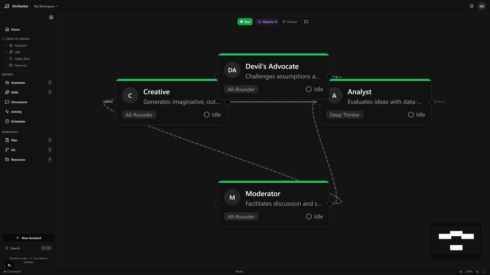
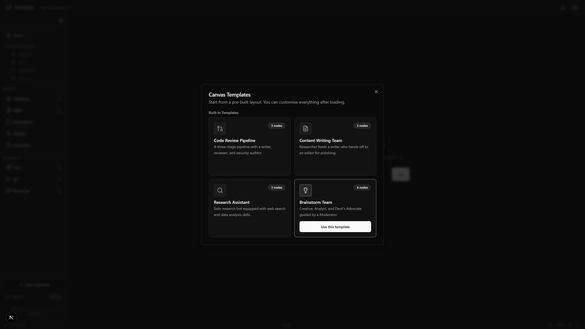
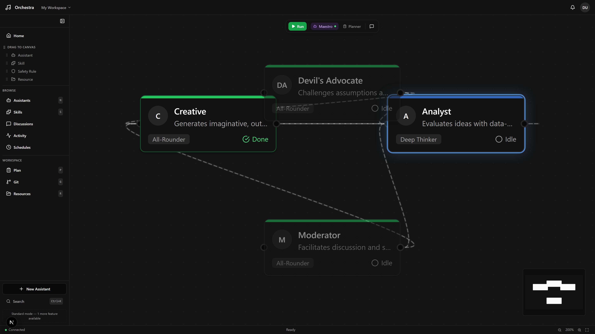
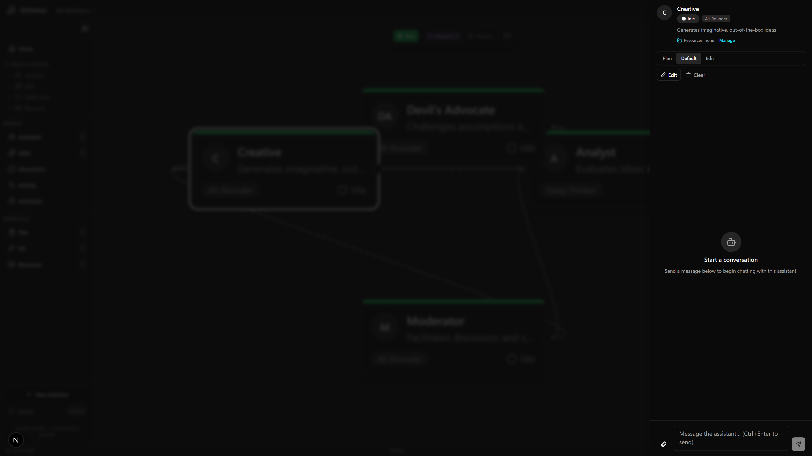
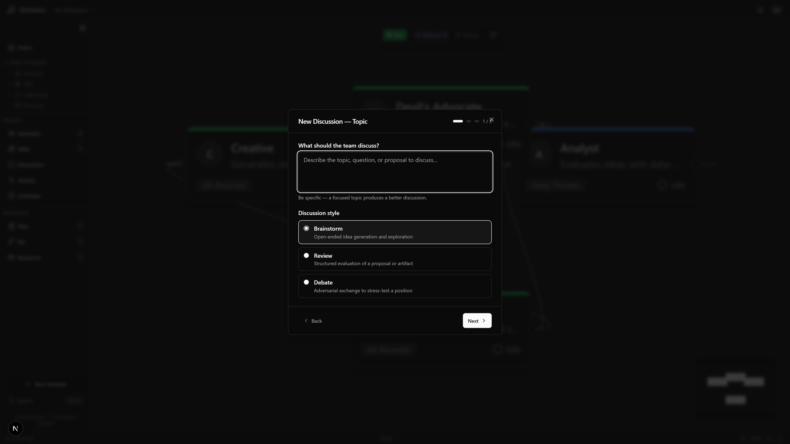

# Orchestra

Build AI agent teams visually. Describe what you need, and Orchestra creates a team of specialized Claude Code agents that work together to get it done.


<p align="center">
  
</p>

---

## Get Started

### Option A: Local Development

```bash
git clone https://github.com/gbrein/Orchestra.git
cd Orchestra
npm run setup    # installs everything, starts database, seeds sample data
npm run dev      # opens at http://localhost:3000
```

> **You need:** Node.js 18+, Docker Desktop, and [Claude Code CLI](https://docs.anthropic.com/en/docs/claude-code) installed and authenticated.

### Option B: Full Docker (everything in containers)

```bash
git clone https://github.com/gbrein/Orchestra.git
cd Orchestra
cp .env.example .env   # edit .env (see below)
docker compose up      # builds and starts all services
```

Edit `.env` before running:
- **`BETTER_AUTH_SECRET`** — replace with a random string (e.g., `openssl rand -hex 32`)
- **`ANTHROPIC_API_KEY`** — your Anthropic API key (required for agents to work)

This starts 4 containers:

| Container | Port | What it does |
|-----------|------|-------------|
| `orchestra-postgres` | 5432 | PostgreSQL database |
| `orchestra-server` | 3001 | Fastify backend + Socket.IO + Claude Code CLI |
| `orchestra-ui` | 3000 | Next.js frontend |
| `orchestra-migrate` | — | Runs database migrations once, then stops |

Open [http://localhost:3000](http://localhost:3000).

```bash
# Other Docker commands
npm run docker:all           # same as docker compose up --build
npm run docker:all:detach    # run in background
npm run docker:up            # start only PostgreSQL (for local dev)
npm run docker:down          # stop everything
```

> **You need:** Docker Desktop only. Node.js is NOT required for Docker mode.

On first visit, create a local account (email/password). Then just describe what you want to build.

---

## How It Works

<p align="center">
  
</p>

1. **Describe** what you need in plain English — or pick a template
2. **Review** the AI-generated team of agents with their models and skills
3. **Run** the workflow on the visual canvas — watch agents execute in real time
4. **Improve** with Advisor analysis and suggestions after each run

---

## Visual Canvas

<p align="center">
  
</p>

Drag agents, skills, and policies onto an interactive canvas. Connect them with edges to define execution flow. Everything auto-saves.

| Feature | Details |
|---------|---------|
| **Node types** | Agents, Skills, Safety Rules, Resources, MCP Servers, Sticky Notes |
| **Connections** | Flow edges (execution order) and association edges (configuration) |
| **Interaction** | Drag-and-drop from sidebar, undo/redo (Ctrl+Z), keyboard shortcuts (?), command palette (Ctrl+K) |
| **Templates** | Code Review Pipeline, Content Team, Research Assistant, Brainstorm Team |
| **Execution feedback** | Active agents glow blue, completed show green checkmark, pending are dimmed |
| **Workspaces** | Multiple project-based workspaces, each tied to a folder on your machine |

---

## Agent Configuration

<p align="center">
  
</p>

Each agent has a model, persona, skills, memory, and MCP connections — all configurable from the side panel.

| Tier | Best for | Cost |
|------|----------|------|
| **Opus** (Deep Thinker) | Complex analysis, architecture, code review | ~$0.08/msg |
| **Sonnet** (All-Rounder) | Coding, writing, general tasks | ~$0.02/msg |
| **Haiku** (Quick Helper) | Simple chat, formatting, high-volume tasks | ~$0.005/msg |

The Workflow Generator picks the right model for each agent automatically. You can always change it.

---

## Team Discussions

<p align="center">
  
</p>

Multiple agents brainstorm, review, or debate a topic together. An automated facilitator manages turn order and synthesizes conclusions.

---

## Smart Execution

- **Planner** reviews your workflow before running and suggests optimizations
- **Maestro** orchestrates between steps, contextualizing output for the next agent
- **Advisor** analyzes completed runs and suggests improvements

---

## Schedule Recurring Tasks

Set agents or workflows to run on a schedule (e.g., "code review every weekday at 9am"). Presets make it easy, or use custom cron expressions.

---

## Skills

Skills are instruction sets that give agents specialized abilities. Orchestra includes 5 built-in skills:

- **Code Review** — security, performance, maintainability analysis
- **Writing Assistant** — blog posts, emails, documentation
- **Data Analysis** — patterns, statistics, visualizations
- **API Designer** — REST endpoints, schemas, documentation
- **Test Writer** — unit, integration, and edge case coverage

You can also import skills from any Git repository.

---

## Safety First

Three layers of policies (global, per-agent, per-session) control what agents can do. Risky commands require your approval before executing. Budget limits prevent runaway costs.

---

## Development

### Commands

```bash
npm run dev              # Start everything
npm run dev:ui           # Frontend only (port 3000)
npm run dev:server       # Backend only (port 3001)
npm run db:migrate       # Run database migrations
npm run db:seed          # Load sample data
npm run db:studio        # Visual database browser
npm run docker:up        # Start PostgreSQL
npm run docker:down      # Stop PostgreSQL
npm run build            # Build all packages
npm run lint             # Lint all packages
npm run test             # Run tests
npm run screenshots      # Capture README screenshots (requires running app)
```

### Environment Variables

`npm run setup` generates a `.env` file automatically. Only edit if you want OAuth:

| Variable | Required | What it does |
|----------|----------|-------------|
| `DATABASE_URL` | Auto | PostgreSQL connection |
| `BETTER_AUTH_SECRET` | Auto | Session encryption (random, never commit) |
| `BETTER_AUTH_URL` | Auto | Backend URL |
| `GITHUB_CLIENT_ID` | No | Enable GitHub login |
| `GITHUB_CLIENT_SECRET` | No | GitHub OAuth secret |
| `GOOGLE_CLIENT_ID` | No | Enable Google login |
| `GOOGLE_CLIENT_SECRET` | No | Google OAuth secret |

### Tech Stack

| What | Technology |
|------|-----------|
| Frontend | Next.js 14, React 18, TypeScript, Tailwind CSS, shadcn/ui, React Flow v12 |
| Backend | Fastify, Socket.IO |
| Database | PostgreSQL 16 + Prisma ORM |
| AI Engine | Claude Code CLI (spawned as subprocesses) |
| Auth | Better Auth (email/password + OAuth) |
| Monorepo | npm workspaces + Turborepo |

### Project Layout

```
orchestra/
├── packages/
│   ├── ui/                # Next.js frontend
│   │   └── src/
│   │       ├── app/       # Pages (canvas, login, register)
│   │       ├── components/
│   │       │   ├── canvas/ # React Flow canvas, nodes, edges, toolbar
│   │       │   ├── panels/ # Right-side panels (chat, drawer, marketplace, etc.)
│   │       │   └── shell/  # Layout (sidebar, top bar, bottom bar)
│   │       ├── hooks/     # Socket, auth, canvas, resources, notifications
│   │       └── lib/       # API client, socket client, canvas utilities
│   │
│   ├── server/            # Fastify backend
│   │   ├── prisma/        # Database schema + migrations
│   │   └── src/
│   │       ├── engine/    # Spawner, Planner, Maestro, Advisor, Scheduler, Chain Executor
│   │       ├── routes/    # REST API (agents, skills, policies, schedules, etc.)
│   │       ├── socket/    # Real-time event handlers
│   │       ├── auth/      # Authentication middleware
│   │       ├── skills/    # Skill catalog + installer
│   │       └── discussion/# Multi-agent discussion engine
│   │
│   └── shared/            # TypeScript types used by both packages
│
├── docker-compose.yml     # PostgreSQL container
└── turbo.json             # Build pipeline
```

---

## Architecture at a Glance

```
Browser                       Server                        Claude Code
  |                             |                               |
  |-- Socket.IO -------------->|                               |
  |   "run this workflow"      |-- spawn (no shell!) -------->|
  |                             |   --output-format stream-json |
  |                             |                               |
  |<-- streaming text ---------|<-- stdout JSON events --------|
  |<-- tool use cards ---------|                               |
  |<-- approval request -------|   (policy intercepted)        |
  |-- approve/reject --------->|-- stdin response ----------->|
  |                             |                               |
  |<-- done + token usage -----|<-- exit --------------------- |
```

**Key design decisions:**
- Agents are Claude Code CLI subprocesses — never `shell: true`
- Real-time streaming via Socket.IO (typed events end-to-end)
- Canvas state auto-saved to PostgreSQL with 2-second debounce
- Policy resolution: most restrictive always wins
- One right-side panel open at a time (managed by `usePanel` hook)

---

## Security

- No `shell: true` anywhere — all commands use argument arrays
- All API routes require authenticated session
- Socket.IO validates session cookie on connection
- Input validation with Zod on every endpoint
- Path traversal protection on filesystem routes
- Child processes receive only essential environment variables (never DB credentials)
- Approval timeout: unanswered requests auto-reject after 5 minutes
- Secret variables encrypted with AES-256-GCM before database storage
- CORS enforced on both HTTP and WebSocket

---

## Accessibility

Orchestra uses friendly language throughout:

| Internal term | What users see |
|---------------|---------------|
| Agent | Assistant |
| Persona | Personality |
| Policy | Safety Rule |
| MCP Server | Connection |

Other accessibility features: ARIA labels on all interactive elements, full keyboard navigation, progressive complexity (Simple/Standard/Full modes), and human-readable error messages.

---

## Contributing

```bash
# Fork, clone, then:
npm run setup
npm run dev

# Before submitting a PR:
npm run test
npm run lint
```

**Code conventions:** immutable data patterns, explicit error handling, Zod validation at boundaries, files under 800 lines, functions under 50 lines, consistent `{ success, data?, error? }` API envelope.

---

## License

[MIT](LICENSE)
